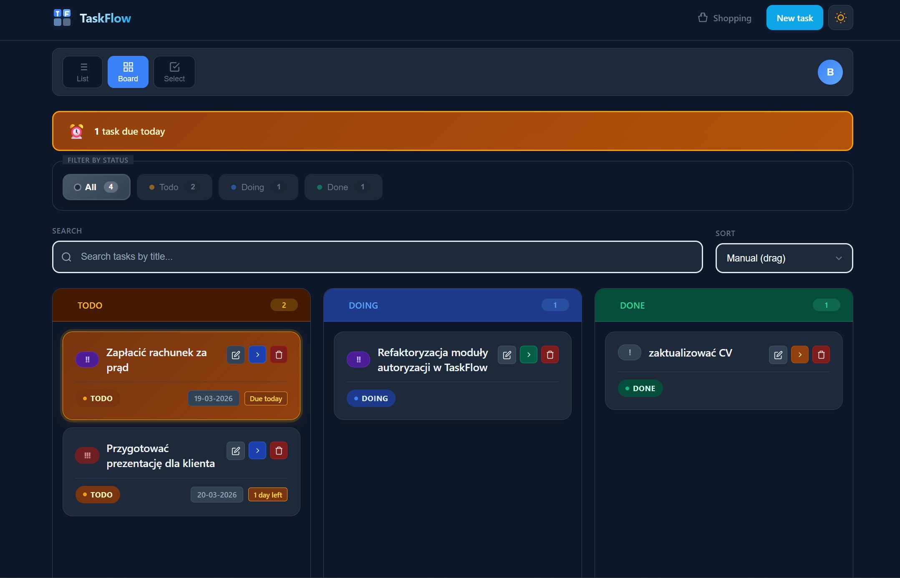

# TaskFlow

Modern task management application built with Angular. Organize your work with an intuitive kanban-style board, track progress, and stay productive.



## ✨ Features

- **Kanban Board** – Visual task management with drag-and-drop (todo/doing/done)
- **Smart Filtering** – Filter by status and search by title
- **Bulk Actions** – Select and manage multiple tasks at once
- **Responsive Design** – Works seamlessly on desktop, tablet, and mobile
- **Real-time Updates** – Instant status changes and synchronization
- **Authentication** – Secure sign-in with Google or magic link

## 🚀 Live Demo

[https://taskflow-demo.vercel.app](https://taskflow-two-ebon.vercel.app/)

## 🛠 Tech Stack

| Category         | Technology      |
| ---------------- | --------------- |
| Framework        | Angular 21+     |
| Language         | TypeScript 5.9+ |
| Styling          | SCSS            |
| State Management | Angular Signals |
| Authentication   | Firebase Auth   |
| Database         | Firestore       |
| Drag & Drop      | Angular CDK     |
| Package Manager  | pnpm            |
| Build Tool       | Angular CLI     |

## 📦 Installation

```bash
# Clone repository
git clone https://github.com/Blazej90/taskflow.git
cd taskflow

# Install dependencies
pnpm install

# Run development server
pnpm start

# Open http://localhost:4200
```

🎯 Key Features Implemented

- Standalone Components
- Reactive Forms with validation
- Signals for state management
- Route guards for protected routes
- CDK Drag & Drop for kanban board
- Responsive mobile-first design

👨‍💻 Author

- Błażej Bartoszewski
- Portfolio: https://blazej-portfolio-sand.vercel.app
- GitHub: @Blazej90
- LinkedIn: Błażej Bartoszewski

📄 License
MIT License
